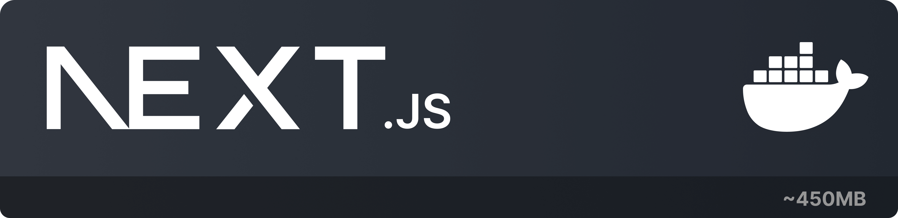

# NextJS Docker Image



Docker image created for Development and Production environments with NextJS.

Image size is around 450 MB(100MB docker image + dependencies), couldn't get it smaller than that cause its for development and production environment both. You can find better images for production only.

## Features

- Development and Production environments
- Hot reloading
- `.env` and `.env.local` automatically loaded if they exist
- simple `make` commands to start the container

## Requirements

You need to have Docker installed in your machine. You can download it [here](https://www.docker.com/products/docker-desktop).

Also you need to have `make` installed in your machine.
for MacOS you can install it using `brew`:

```bash
brew install make
```

for windows you can install it using `chocolatey`:

```bash
choco install make
```

tutorial for installing `make` in windows can be found [here](https://leangaurav.medium.com/how-to-setup-install-gnu-make-on-windows-324480f1da69)

## Usage

### Development

```bash
make up
```

### Production

```bash
make prod
```

Runnings the above commands will start the container and the application will be available at `http://localhost:3000` for development and `http://localhost:8080` for production.

To stop the container:

```bash
ctrl + c
```

## License

This project is licensed under the MIT License - see the [LICENSE](LICENSE) file for details.

## Note

> To use the Image provided by Nextjs you need to have `sharp` as a dependency in your project. If you don't have it, you can install it using the following command:

```bash
npm install sharp
```
